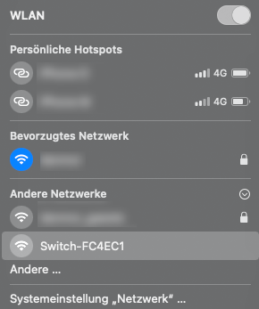
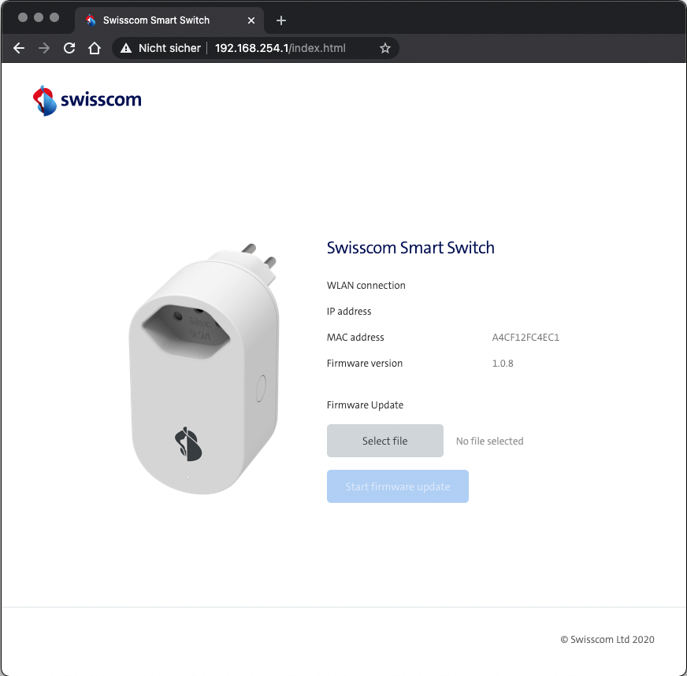
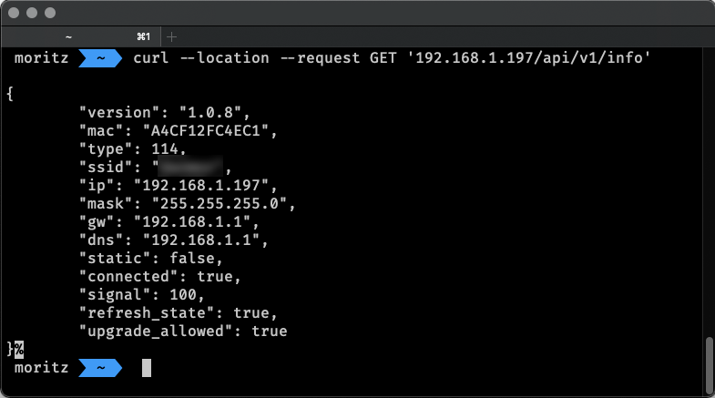

# Swisscom Smart Switch

To use the [Swisscom Smart Switch](https://www.swisscom.ch/de/privatkunden/produkte/smart-home/details.html/swisscom-smart-switch-11048015) without the Home App follow these steps.

## Installation

* Plugin Switch and connect to the generic Wifi "`Switch-XXXXXX`" (last 6 digits from the MAC-Address)



* Check connection and open `192.168.254.1` in your Browser, you should see the status Page.



* Open your Terminal and POST the request with your credentials:
```bash
curl --location --request POST '192.168.254.1/api/v1/connect' \
--header 'Content-Type: application/x-www-form-urlencoded' \
--data-raw '{
    "ssid": "<YOUR-WIFI-SSID>",
    "passwd": "<YOUR-WIFI-PASSWORD>"
}'
```
* After a few second your Smart Switch is available in your Network.

You can test the connection with a simple status request:
```bash
curl --location --request GET '<SMART-SWITCH-IP>/api/v1/info'
```



## API

The MyStrom API should mostly be available for the Smart Switch (except the sensor and power meter).

https://api.mystrom.ch/#